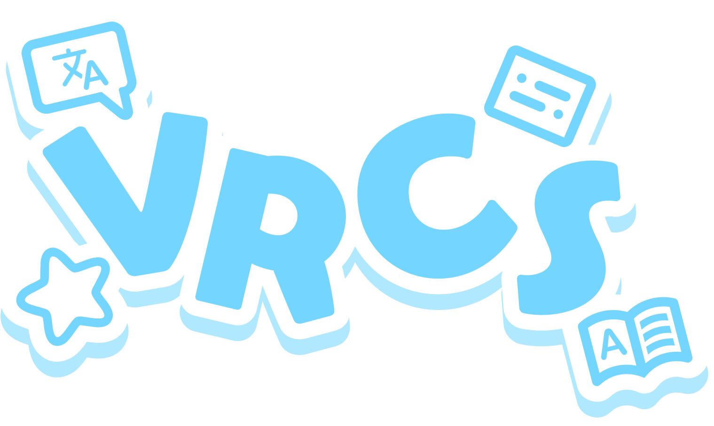
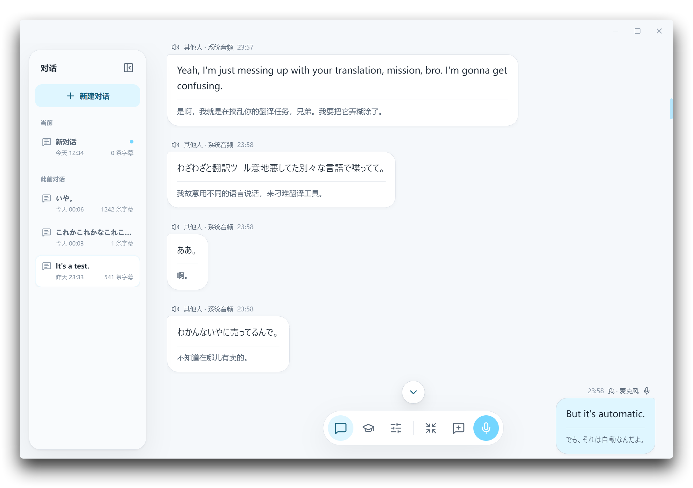

<p align="center">
    
</p>

# VRCS

[English](README.md) | [简体中文](README.zh-CN.md) | **繁體中文** | [日本語](README.ja-JP.md)



VRCS 是面向 VRChat 的 Windows 即時字幕、翻譯與語言學習工具。擷取系統音訊及麥克風輸入，在桌面或 SteamVR 中顯示字幕；透過 OCR 翻譯畫面中的文字，並將字幕用於查詞、學習分析及 Anki 製卡。

[下載](https://github.com/Dreaminko/VRCS/releases/latest) · [回報問題](https://github.com/Dreaminko/VRCS/issues) · [參與貢獻](CONTRIBUTING.md) · [Discord](https://discord.gg/53H872eYq) · [QQ 群組](https://qm.qq.com/q/i9kOOxFn44)

## 安裝

從 [GitHub Releases](https://github.com/Dreaminko/VRCS/releases) 下載 `VRCS-<version>-windows-x64.exe`。

- Windows 10 / 11，需安裝 [Microsoft Visual C++ v14 Redistributable（x64）](https://aka.ms/vs/17/release/vc_redist.x64.exe)。
- 本機 Qwen ASR 支援 CPU 或 Vulkan，請在辨識設定中下載執行元件及模型。
- 首次使用需連網下載 Silero VAD 模型；啟用語意斷句時還需下載 Smart Turn 模型。
- 雲端辨識、翻譯及學習分析需要對應服務供應商的 API 認證資訊，供應商可能收取費用。
- OCR 可選擇下載本機模型，或設定 PaddleOCR 雲端存取權杖。

## 開始使用

1. 按設定精靈選擇語言，以及本機或雲端辨識。
2. 選擇系統音訊、VRChat 程序音訊或麥克風，測試麥克風並調整語音啟動門檻值。
3. 開始轉錄，按需啟用翻譯、Chatbox 輸出或 SteamVR 字幕。

可從「設定 › 系統」重新執行精靈。雲端辨識可參考[阿里巴巴百煉免費額度入門（簡體中文）](./docs/AlibabaCloud_Free.md)。

## 主要功能

- 系統或 VRChat 程序音訊與麥克風雙串流即時字幕，支援獨立音源控制、精簡視窗及本機工作階段記錄。
- 本機 Qwen3 ASR 支援 CPU 或 Vulkan；雲端辨識支援 Qwen3 ASR、Fun-ASR、OpenAI Realtime、Gemini 及 Groq。Silero VAD 與可選的 Smart Turn 用於語音分段。
- 手動或自動翻譯，支援 DeepL、Microsoft Translator、OpenAI、Gemini、Alibaba Cloud LLM 及相容 OpenAI 的服務。系統音訊與麥克風可分別設定最多三種目標語言，並為各語言選擇服務及模型。
- Qwen Live Translate、Gemini Live Translate（預覽）及 OpenAI Realtime Translation 可直接產生即時原文與譯文，翻譯每路音源的第一目標語言；Qwen 還支援區分說話者。
- 自訂提示詞、本機術語表、線上術語訂閱及近期字幕上下文；可選擇讀取 [VRCX-0](https://vrcx-0.dev/) 的世界與成員資訊。語言預設可儲存並切換辨識語言、翻譯目標及 Chatbox 傳送策略。
- 將麥克風最終字幕及譯文傳送至 VRChat OSC Chatbox，支援快速輸入、翻譯預覽及多語言傳送。啟用 OSCQuery 靜音同步後，靜音或狀態未知時停止自動傳送。
- SteamVR 頭戴裝置字幕與手腕對話視圖，支援原文、譯文及多語言顯示。可在儀表板中調整語言、字幕位置、大小、透明度及 Chatbox 設定。
- 桌面 OCR：VRChat 位於前景時，使用可自訂的快捷鍵框選文字，結果視窗顯示原文及多語言譯文，支援複製與重新辨識。
- VR OCR：透過手勢或控制器選擇文字區域，譯文可顯示在手腕面板或原文位置的雙眼疊加層。
- OCR 支援 PaddleOCR 雲端及本機 PP-OCRv6；本機模型可在設定中下載，使用 CPU 或 DirectML GPU。
- 匯入 Yomitan 字典包，在字幕中查詞或「問 AI」，收集學習素材並進行詞義解釋、句型分析及對話回顧。編輯詞彙、句型或克漏字卡片草稿，透過 AnkiConnect 製作卡片。

## 隱私

VRCS 不儲存原始音訊，字幕記錄、學習項目、字典及設定預設儲存在本機。本機 Qwen ASR 與本機 OCR 在裝置上處理語音及影像；雲端辨識將語音片段或框選影像傳送給所選供應商。

翻譯、學習分析及「問 AI」會將相關文字、明確選擇的上下文及提交的問題傳送給設定的服務。本機辨識後的文字是否傳送至雲端，取決於所選翻譯及 AI 服務。

## 開發

需要 Windows 10 / 11、Node.js 24+、Rustup（版本及元件見 `rust-toolchain.toml`）、Visual Studio Build Tools 的「使用 C++ 的桌面開發」工作負載，以及已加入 `PATH` 的 CMake。

在儲存庫根目錄的 PowerShell 中執行：

```powershell
npm install
npm run dev
```

預設建置使用 CPU 執行本機 Qwen ASR。Vulkan 加速使用 `npm run dev:vulkan`，命令會自動準備載入器，不需 GPU SDK 或著色器編譯器。Qwen 執行元件及模型在辨識設定中下載。獨立後端開發見 [Core README](core/README.md)。

依變更範圍執行檢查：

```powershell
npm run check:i18n
npm --workspace apps/desktop test
npm run build:frontend
.\scripts\check-rust.ps1
```

Rust 指令碼對兩個 crate 執行格式檢查、Clippy 及測試；Vulkan 相關變更新增 `-Vulkan`。

建置支援 CPU 及 Vulkan 的 Windows 安裝程式：

```powershell
npm run build
```

貢獻指南見 [CONTRIBUTING.md](CONTRIBUTING.md)，介面翻譯指南見 [LOCALIZATION.md](LOCALIZATION.md)。

## 授權

[GNU Affero General Public License v3.0](LICENSE)（`AGPL-3.0-only`）。第三方授權見 [THIRD_PARTY_NOTICES.md](THIRD_PARTY_NOTICES.md)。
