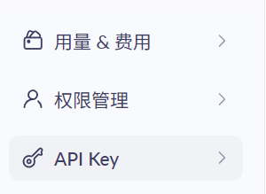
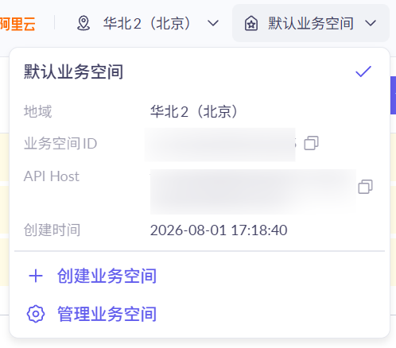

# 使用阿里云百炼免费额度快速开始

阿里云的百炼服务有提供免费的 QwenASR/FunASR 额度，给 VRCS 使用足矣。

前往 [这里](https://bailian.console.aliyun.com/cn-beijing?spm=5176.29619931.J_egCN4Yq1EkFrYZT7V5X0j.d_primary.74cd10d7Uf1b2o&tab=model#/efm/model_experience_center/voice?modelId=qwen3-asr-flash) 进行注册。

在页面的左下角进入 API KEY 管理页面

右上角创建API后，将 API Key 粘贴到 VRCS 的 API 管理页面中，再从管理页面的右上角获取业务空间 ID 填到 Workspace ID 中。

填写完毕后记得在管理页面的右下角，用量&费用中设置一下免费额度用完即停，以免产生不必要的额外开销。
