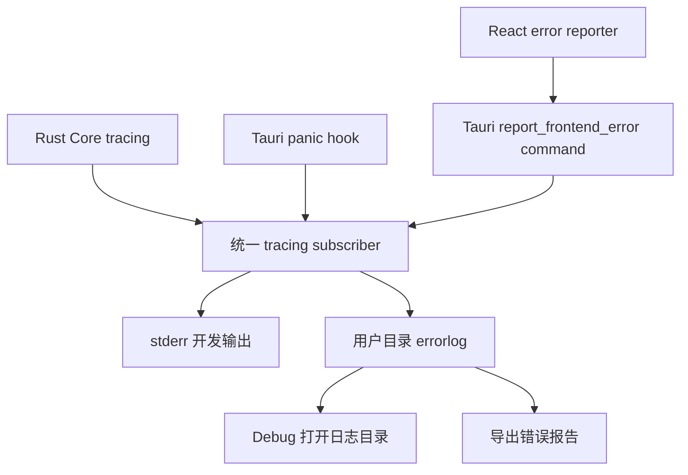

# 错误报告与本地 errorlog 功能计划书

本文基于 VRCS 当前实现，规划桌面端错误报告和本地诊断日志能力。目标是在不上传用户数据、不保存原始音频的前提下，把足以定位启动、Core、音频、识别、翻译和前端异常的信息保存在用户目录，并让用户能够直接找到和导出。

## 1. 结论

推荐复用现有 Rust `tracing` 基础设施，将安装版日志统一保存为：

```text
%LOCALAPPDATA%\.vrcs\logs\errorlog.YYYY-MM-DD.log
```

独立运行 Core 时继续使用 `VRCS_LOG_DIR`；未设置时保存到配置文件旁的 `logs` 目录。

首期应完成四项能力：

1. 将现有运行日志规范化为可诊断的 `errorlog`，按天轮转并限制保留数量。
2. 捕获 Rust panic、Core 启动失败、前端渲染异常和未处理 Promise rejection。
3. 在“设置 → Debug”提供“打开日志目录”和“导出错误报告”入口。
4. 建立明确的脱敏、限流和日志分级规则，禁止写入密钥、音频、字幕正文、翻译 Prompt 和完整请求体。

不建议只记录 `ERROR` 级别。单独的错误文本通常缺少启动顺序、后端选择、重试和回退信息；`errorlog` 应保留少量 `INFO` 生命周期事件、`WARN` 可恢复异常和 `ERROR` 失败事件，但不能记录用户内容。

## 2. 当前实现盘点

| 领域 | 当前状态 | 主要缺口 |
|---|---|---|
| Rust 日志 | `core/src/lib.rs` 已使用 `tracing-subscriber` 和 `tracing-appender`，按天写入 `vrcs-core.YYYY-MM-DD.log`，最多保留 4 份 | 文件名和用户入口不明确；保留期偏短；缺少统一事件字段和脱敏约束 |
| 桌面启动 | `apps/desktop/src-tauri/src/lib.rs` 在 Tauri 构建前初始化日志，目录为 `%LOCALAPPDATA%\.vrcs\logs` | panic 和 Tauri 构建失败没有专门的崩溃上下文；日志初始化失败会直接 panic |
| Core 错误 | 音频、ASR、模型下载、外部 API 等路径已有 `tracing::warn!` / `tracing::error!` | 各事件字段不完全一致，难以按会话、操作和错误码关联 |
| API 错误 | Core 已有稳定错误码契约，前端通过 `ApiError` 展示错误 | 前端网络异常、响应解析异常和未处理异常不会进入 Rust 日志 |
| React | `apps/desktop/src/main.tsx` 直接渲染 `<App />` | 没有 Error Boundary、`window.error` 或 `unhandledrejection` 采集 |
| Debug 页面 | 已展示配置、设备数量和模型状态 | 没有日志路径、打开目录、导出报告或报告 ID |
| 隐私 | `docs/privacy.md` 已声明不保存原始音频，凭据使用 Windows 凭据管理器 | 尚未说明本地诊断日志会保存哪些元数据、保留多久以及如何删除 |

## 3. 目标与非目标

### 3.1 目标

- 应用正常运行、异常退出或功能失败后，用户目录中存在可供排查的日志。
- 用户无需手动输入路径，可以从 Debug 页面打开日志目录。
- 用户可以导出一个经过约束的错误报告文件，提交 issue 时直接附加。
- Rust Core、Tauri 主进程和 React 前端的异常使用同一会话 ID 关联。
- 日志文件有明确上限，不会无限占用磁盘。
- 日志默认离线保存，不自动上传，不依赖外部错误报告服务。
- 日志格式对用户可读，同时保留稳定字段，便于未来编写自动分析工具。

### 3.2 首期不包含

- 自动上传日志、遥测、崩溃统计或第三方错误跟踪服务。
- Windows minidump、访问冲突等原生进程崩溃转储。首期只保证捕获 Rust panic 和应用内可观察异常。
- 保存原始音频、字幕正文、Chatbox 内容、词典内容或翻译上下文。
- 保存 API Key、Token、Cookie、Authorization Header、完整请求体或完整响应体。
- 将所有业务校验失败都提升为错误报告。用户输入无效、未启动 VRChat 等预期状态仍按现有 UI 提示处理。
- 新增依赖。首期使用现有 `tracing`、`tracing-appender`、`serde`、`serde_json`、Tauri command 和 dialog 能力。

## 4. 用户体验

### 4.1 正常运行

应用静默写入日志，不弹提示、不阻塞主流程。每次启动写入一条会话头信息，包括：

- `session_id`
- VRCS 应用版本和 Core 版本
- 标准版或 CUDA 版
- 操作系统和进程架构
- UI 语言
- 当前 ASR 后端及本地/CUDA 可用状态
- 配置 schema 版本

会话头不得包含用户名、完整用户目录、音频设备名称、API Profile 自定义名称或用户输入内容。

### 4.2 可恢复错误

现有 UI 提示保持不变，同时写入一条 `WARN` 或 `ERROR` 日志。事件至少包含：

- 发生时间
- `session_id`
- 组件和操作名
- 稳定错误码；没有稳定错误码时使用受控的内部分类
- 安全的错误摘要和 cause chain
- 是否已重试、回退或恢复
- `report_id`，用于用户反馈时快速定位

重复错误必须去重。同一 `component + operation + code` 在短时间内连续发生时，只记录第一次、周期摘要和最终累计次数，避免网络断开或设备重试导致日志快速膨胀。

### 4.3 前端致命错误

React Error Boundary 捕获渲染异常后显示本地化兜底页面，提供：

- “重新加载界面”
- “打开日志目录”
- “复制报告 ID”

错误详情不直接完整展示给普通用户，但必须写入本地日志。若 Core 仍可用，重新加载前端不应强制清空设置或数据库。

### 4.4 Debug 页面

在现有“设置 → Debug”增加诊断区域：

- 日志目录：显示 `%LOCALAPPDATA%\.vrcs\logs` 等脱敏后的路径
- 当前会话 ID
- 最新报告 ID；没有错误时显示“无”
- “打开日志目录”按钮
- “导出错误报告”按钮
- 说明文字：“报告保存在本机，不会自动上传；提交前可自行查看内容。”

“导出错误报告”首期生成一个文本报告，建议命名：

```text
VRCS-error-report-20260815-153045.txt
```

内容由诊断摘要和最近的 `errorlog` 组成。用户通过现有保存对话框选择目标位置。导出失败时仍允许打开日志目录手动获取文件。

## 5. 文件与保留策略

### 5.1 文件位置

安装版：

```text
%LOCALAPPDATA%\.vrcs\logs\errorlog.YYYY-MM-DD.log
```

独立 Core：

```text
%VRCS_LOG_DIR%\errorlog.YYYY-MM-DD.log
```

未设置 `VRCS_LOG_DIR` 时：

```text
<config.json 所在目录>\logs\errorlog.YYYY-MM-DD.log
```

### 5.2 轮转和清理

- 按本地日期每日轮转。
- 默认保留最近 7 个日志文件。
- 启动时清理超过保留数量的旧 `errorlog.*.log`。
- 保留现有旧名称 `vrcs-core.*.log`，不迁移、不覆盖；新版本运行后自然生成 `errorlog.*.log`。
- 单条前端错误消息、stack 和附加字段分别设置长度上限，超出时截断并写入 `truncated=true`。
- 对高频重复事件限流，防止单日文件因重试循环异常增长。

首期不实现复杂的按字节滚动。若实际发布后出现单日日志过大的证据，再增加“单文件大小 + 日期”双重轮转；不要在没有问题证据时引入自定义日志 writer。

## 6. 日志格式

首期继续使用 UTF-8 单行文本，保持用户可直接用记事本打开。每条记录采用稳定键值字段，例如：

```text
2026-08-15T15:30:45.123+08:00 ERROR vrcs_desktop::frontend session_id=... report_id=... component=frontend operation=render code=frontend.render_failed message="React render failed" error="..." stack="..."
```

建议统一字段：

| 字段 | 含义 |
|---|---|
| `session_id` | 每次进程启动生成的随机 ID |
| `report_id` | 每次独立错误生成的短 ID，供用户反馈引用 |
| `component` | `desktop`、`core`、`frontend`、`audio`、`asr`、`translation`、`storage` 等 |
| `operation` | 稳定操作名，例如 `core_startup`、`capture_start`、`settings_save` |
| `code` | Core 稳定错误码或内部受控错误分类 |
| `recoverable` | 是否可恢复 |
| `retrying` | 是否正在重试 |
| `fallback` | 是否启用了 CPU、能量 VAD 等回退 |
| `elapsed_ms` | 操作耗时，适用时记录 |
| `repeat_count` | 去重窗口内的累计次数 |

日志正文使用英文稳定消息，便于跨语言检索；面向用户的按钮和提示继续使用 i18n。

## 7. 采集边界

### 7.1 Rust Core 和 Tauri

继续使用现有 `tracing`，但统一关键失败路径：

- 应用启动、配置加载、数据库打开和 Core 监听失败
- 音频设备枚举、采集启动、采集中断、重试和恢复
- VAD 模型准备及能量检测回退
- ASR 模型下载、校验、加载、CUDA 回退和转写失败
- 云端 ASR、翻译 Provider、Anki 和外部 API 的网络/鉴权/限流/超时分类
- 设置保存和配置迁移失败
- Core 优雅停止超时或失败

为 `apps/desktop/src-tauri/src/lib.rs` 安装 panic hook。hook 记录：

- panic payload 的安全文本
- 源文件和行号
- 线程名
- `session_id`
- `report_id`
- backtrace；仅在 panic 时采集，并受长度上限约束

panic hook 必须调用原 hook 或保留等价的 stderr 输出，不能吞掉开发环境诊断。

日志初始化失败不能再次依赖日志系统。安装版应向 stderr 输出，并尝试在 `%TEMP%` 写入一份最小启动失败文本；若仍失败，再退出。该兜底不作为常规日志路径。

### 7.2 React 前端

新增统一的前端错误报告模块，捕获：

- React Error Boundary 的 `componentDidCatch`
- `window.addEventListener("error", ...)`
- `window.addEventListener("unhandledrejection", ...)`
- 初始化 i18n 和首次 render 失败
- 无法解析 Core 响应、网络连接意外中断等非预期错误

前端通过受限 Tauri command 上报到 Rust 主进程，例如：

```text
report_frontend_error({
  kind,
  operation,
  message,
  stack,
  componentStack
})
```

Rust 端必须：

- 校验 `kind` 和 `operation`，不接受任意日志级别或任意 target。
- 对所有字符串执行长度限制和换行规范化。
- 生成最终 `report_id`，前端不能自行指定。
- 通过 `tracing::error!` 写入统一日志。
- 返回 `report_id` 给前端兜底页面显示。

非 Tauri 的 Vite 开发模式只输出到浏览器控制台，不尝试写用户目录。

### 7.3 API 错误

不要在前端重复记录所有非 2xx 响应。建议规则：

- 预期的 4xx 业务错误：由 Core 在必要时记录，前端只展示本地化提示。
- 5xx、网络连接失败、超时、响应格式损坏：前端记录操作名和端点模板，不记录 query、Authorization 或 body。
- 同一错误若 Core 已有对应 `report_id`，前端复用该 ID，不再生成第二条错误。

“端点模板”指 `/api/asr/profiles/{id}/test`，不能把真实 Profile ID、查询参数或用户输入拼入日志。

## 8. 脱敏和隐私规则

### 8.1 永不记录

- API Key、Bearer Token、第三方输出 API Token、Core session token
- `Authorization`、`Cookie`、`Set-Cookie`、凭据管理器内容
- 原始音频、PCM 数据、音频片段长度序列
- 字幕、Chatbox、查词、Anki 字段和用户输入正文
- 翻译 Prompt、最近原文上下文、术语表内容
- HTTP 请求体和完整响应体
- 完整带 query/fragment 的 URL

### 8.2 可记录但必须约束

- 文件路径：将用户主目录和 `%LOCALAPPDATA%` 前缀替换为环境变量名；只保留诊断所需的末级路径。
- Provider 错误：记录 HTTP 状态、稳定错误码和经过截断的安全摘要，不记录服务商回显的请求内容。
- 设备信息：记录设备数量、默认/指定/VRChat 模式和错误码，不记录设备友好名称。
- 模型信息：可以记录公开模型 ID 和 CPU/CUDA 后端，不记录自定义 Profile 名称。
- panic/前端 stack：保留源文件、模块和行号；对 URL、用户目录和疑似凭据模式执行清理。

### 8.3 文档披露

`docs/privacy.md` 增加“诊断日志”章节，说明：

- 日志默认保存在本机。
- 不会自动上传。
- 默认保留 7 份按日日志。
- 用户可以从 Debug 页面查看、导出或删除。
- 日志包含版本、运行状态、错误摘要和技术 stack，但不应包含音频、字幕或凭据。

## 9. 目标架构



实现边界：

- `vrcs-core` 继续拥有日志初始化和文件 writer，避免桌面端与独立 Core 各自实现一套轮转逻辑。
- Tauri 主进程拥有用户目录解析、panic hook、前端错误 command 和文件导出。
- React 只负责采集浏览器可见异常和用户操作，不直接写文件。

## 10. 分阶段实施

### 阶段一：规范化 Rust errorlog

预计工作量：1 人日。

主要修改：

- `core/src/lib.rs`
  - 将文件前缀从 `vrcs-core` 调整为 `errorlog`。
  - 保留数量从 4 调整为 7。
  - 明确关闭文件 ANSI 控制字符。
  - 在初始化完成后记录会话头和日志路径。
- 建议新增 `core/src/diagnostics.rs`
  - 定义 `session_id`、`report_id`、安全字符串截断、路径脱敏和重复事件限流。
  - 提供 Core 与桌面端共用的最小诊断辅助函数。
- `core/src/main.rs`
  - 独立 Core 写入同名 `errorlog`。
  - 启动和退出失败使用统一字段。
- `apps/desktop/src-tauri/src/lib.rs`
  - 在 Tauri 构建前生成会话 ID 并安装 panic hook。
  - 将 Core 启动失败、构建失败和停止失败写入统一日志。

验收：正常启动后生成当天 `errorlog`；连续启动不会破坏已有日志；只保留最近 7 份；Core 启动失败和测试 panic 可在日志中定位。

### 阶段二：前端采集和 Debug 入口

预计工作量：1.5 人日。

主要修改：

- 建议新增 `apps/desktop/src/error-reporting.ts`
  - 注册 `error` 和 `unhandledrejection` 监听。
  - 规范化 `Error`、字符串 rejection 和未知对象。
  - 对重复事件进行前端侧短窗口去重。
- 建议新增 `apps/desktop/src/components/AppErrorBoundary.tsx`
  - 捕获渲染错误并显示本地化兜底页。
- `apps/desktop/src/main.tsx`
  - 初始化错误采集。
  - 用 Error Boundary 包裹 `<App />`。
  - 捕获 i18n/首次 render Promise 失败。
- `apps/desktop/src-tauri/src/lib.rs`
  - 新增 `report_frontend_error`、`diagnostic_status`、`open_log_directory` 和 `export_error_report` commands。
- `apps/desktop/src/api.ts`
  - 仅对网络、5xx 和响应解析异常补充安全的操作上下文。
- `apps/desktop/src/settings/sections/DebugSettingsSection.tsx`
  - 增加会话 ID、最新报告 ID和操作按钮。
- `apps/desktop/src/i18n/locales/{zh-CN,en-US,ja-JP}.json`
  - 增加按钮、说明、成功/失败消息和前端兜底页文本。

验收：人为触发 React render error、unhandled rejection 和 Core 连接失败后，日志中出现对应事件；Debug 页面可打开目录并导出报告；Vite 浏览器模式不会调用不存在的 Tauri command。

### 阶段三：测试、文档和发布验证

预计工作量：0.5–1 人日。

主要修改：

- `docs/privacy.md`：增加诊断日志披露。
- `README.md`：在数据位置或排障说明中加入日志路径。
- Core 测试：轮转保留、截断、路径脱敏、重复事件限流。
- Tauri Rust 测试：前端错误 payload 校验、导出内容和不存在日志目录时的行为。
- 前端测试：Error 序列化、rejection 规范化、去重和端点模板清理。
- 安装版手工验证：标准版和 CUDA 版各执行一次启动、制造可恢复错误、导出报告、退出重启。

验收：相关单元测试、前端构建、i18n 检查和 Tauri Rust 测试通过；安装版中的日志路径与 README、隐私说明一致。

## 11. 预期测试命令

实施完成后至少执行：

```powershell
.\scripts\test-core.ps1
npm --workspace apps/desktop test
npm run check:i18n
npm run build:frontend
cargo test --manifest-path apps/desktop/src-tauri/Cargo.toml
```

发布前再执行一次实际安装包构建和自检。不能用开发模式日志证明安装版 `%LOCALAPPDATA%` 路径正确，必须在打包运行环境中验证一次。

## 12. 验收标准

功能完成需同时满足：

1. Windows 安装版启动后，`%LOCALAPPDATA%\.vrcs\logs` 中生成当天 `errorlog`。
2. 日志最多保留最近 7 份，新版本不删除旧的 `vrcs-core.*.log`。
3. Core 启动失败、Rust panic、React render error 和 unhandled rejection 均可落盘。
4. 每个独立错误有 `report_id`，同一进程内事件带相同 `session_id`。
5. Debug 页面可以打开日志目录并导出错误报告。
6. 断网、音频设备失败或 Provider 重试不会无限重复刷屏。
7. 自动化测试证明路径脱敏、字段截断和重复事件限流有效。
8. 人工检查导出报告，不包含 session token、API Key、Authorization、字幕、Prompt、Chatbox 文本或用户目录明文。
9. 日志目录不可写时，应用给出可理解的本地提示；除非 Core 本身无法启动，不应因“无法记录日志”导致正常功能直接崩溃。
10. 应用不进行任何自动上传，隐私说明与实际行为一致。

## 13. 风险与应对

| 风险 | 应对 |
|---|---|
| 过度记录导致隐私泄露 | 使用字段白名单和端点模板；禁止 body、用户正文和凭据；增加脱敏单元测试 |
| 重试循环导致日志膨胀 | 对稳定错误键做窗口去重并记录 `repeat_count`；保持 7 份轮转上限 |
| panic 后异步 writer 未及时刷新 | 保持 `WorkerGuard` 生命周期覆盖整个应用；panic hook 写日志后调用原 hook；通过子进程测试验证落盘 |
| 前后端重复记录同一错误 | Core 错误优先生成/返回 `report_id`；前端只补充浏览器边界异常和网络层失败 |
| 日志目录损坏或无权限 | stderr + `%TEMP%` 最小兜底；Debug 页面显示日志不可用状态；不覆盖用户数据 |
| 导出报告包含过多历史内容 | 首期只导出诊断摘要和最近日志；明确文件列表和大小上限，导出前再次执行脱敏 |
| 原生崩溃无法捕获 | 在文档中明确首期边界；若发布后存在实际需求，再单独评估 Windows minidump |

## 14. 总体工作量与发布建议

预计总工作量为 3–3.5 人日，建议作为一个小版本完整交付，不拆成只有日志改名、没有用户入口的半成品。

发布顺序：

1. 完成 Rust 日志规范化、panic hook 和隐私测试。
2. 接入前端错误边界及 Debug 操作。
3. 运行聚焦测试和安装版人工验证。
4. 更新 README 与隐私说明后发布。

首个版本上线后重点观察两项证据：单日日志实际大小，以及用户 issue 中报告能否定位问题。只有出现日志过大或原生崩溃无法排查的实际案例时，再考虑按字节轮转、压缩包或 minidump。