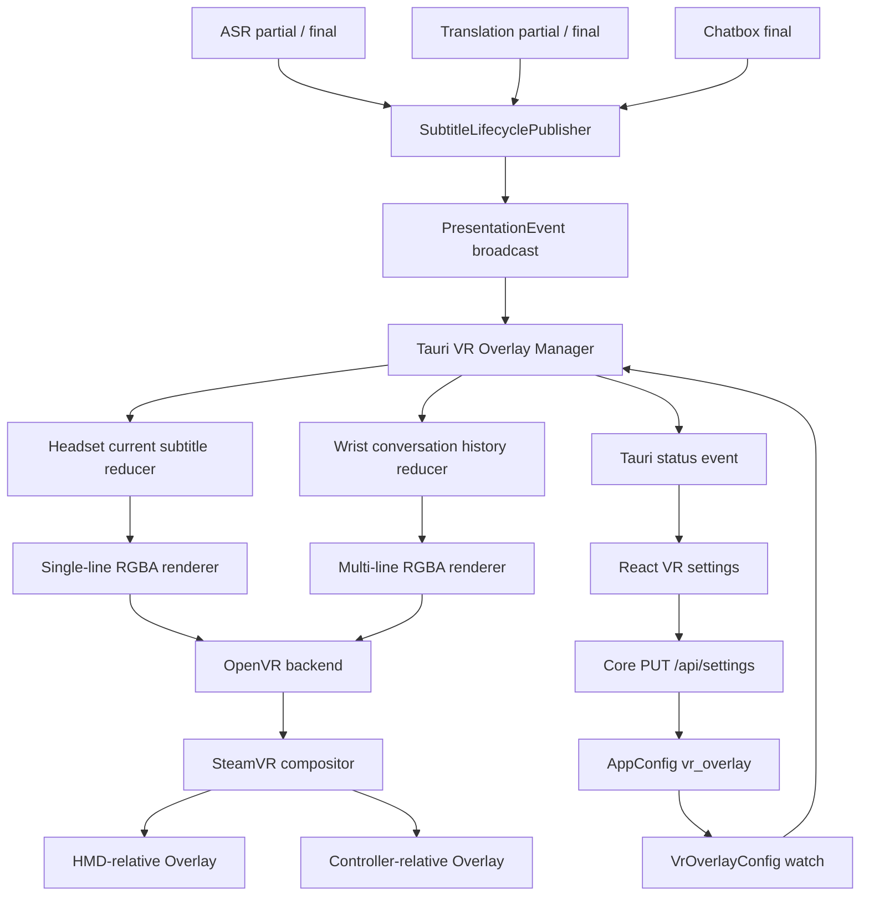
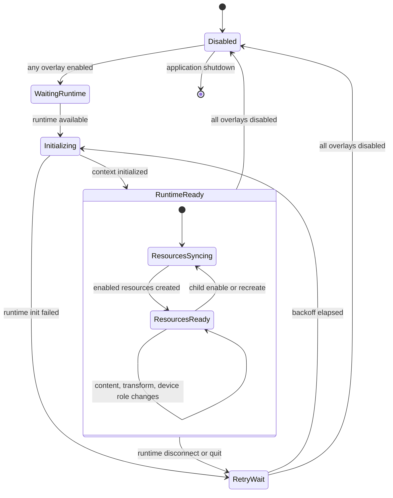

# VR Overlay 功能实现计划

> 状态：MVP 已实现，待 SteamVR/HMD/controller 与安装包验证
>
> 调查基线：2026-08-17
>
> 目标平台：Windows 10/11 x64、SteamVR/OpenVR

## 1. 结论摘要

建议将 VR Overlay 实现为桌面宿主中的一个 **Windows/SteamVR 输出适配器**，放在 `apps/desktop/src-tauri`，并继续由 Core 负责语音识别、翻译、字幕持久化和字幕生命周期发布。

第一版不应复制 VRCT 的 Python、Pillow、NumPy 和进程轮询实现，也不应新增 Python sidecar。推荐路径是：

1. 在 Core 的 `SubtitleLifecyclePublisher` 增加一个面向展示端的窄事件流，统一发布 partial、final 和 translation 事件。
2. 在 Core 配置中增加 `vr_overlay`，沿用现有 `/api/settings`、schema migration、并发修订和前端 autosave 机制。
3. Tauri 宿主订阅展示事件和 `vr_overlay` 配置变更，在专用线程中管理单个 OpenVR context 和两个独立 Overlay resource。
4. `HeadsetSubtitleOverlay` 固定在 HMD 视野前方，显示当前单条字幕；`WristConversationOverlay` 固定在左手、右手或主手控制器，显示最近多条对话。两者可独立开关，也可同时启用。
5. 使用有界 RGBA 纹理渲染字幕，仅在对应 Overlay 内容变化时重新排版和调用 `SetOverlayRaw`；淡出只更新 Overlay alpha。
6. 首期“拖动位置”采用 VRCT 已验证的设置页实时校准：用户开启持续样本后调整左右、上下、距离和旋转并即时看到效果。VR 内控制器直接拖拽作为独立技术 spike，仅在显式编辑模式中启用。

该边界保证 SteamVR 缺失、关闭或重启时，转写、翻译、OSC、字幕历史和桌面 UI 仍可正常运行。

## 2. 调查依据

### 2.1 VRCS 当前能力

VRCS 已具备 Overlay 所需的大部分上游数据链路：

- `core/src/subtitle_output.rs`
  - `SubtitleLifecyclePublisher` 已是 final 字幕、翻译事件、OSC 输出的统一扇出点。
  - 当前可分别订阅 final 字幕和翻译事件。
- `core/src/models.rs`
  - `LiveTranscription` 已提供 partial、失败和音频电平事件。
- `core/src/server/ws.rs`
  - 已将 partial、final、translation 和其他实时事件聚合到 WebSocket。
- `core/src/lib.rs`
  - Core 嵌入 Tauri 进程，但当前 `CoreHandle` 没有公开面向原生输出端的字幕订阅接口。
- `core/src/config/schema.rs`、`core/src/config/migration.rs`、`core/src/server/settings.rs`
  - 配置已具备版本迁移、严格反序列化、验证、原子保存、并发 revision 和运行时重配置。
  - 当前 schema 为 v21；实现 Overlay 配置时需要升级 schema。
- `apps/desktop/src/settings/hooks/useSettingsDraft.ts`、`apps/desktop/src/settings/settings-autosave.ts`
  - 设置页已支持乐观更新和顺序保存。
- `apps/desktop/src-tauri/src/lib.rs`
  - Tauri 负责 Core 启停、托盘、原生窗口和应用退出，是管理 OpenVR 资源生命周期的合适宿主。
- `apps/desktop/src-tauri/tauri.release.conf.json`
  - 发布包当前为 NSIS，并将 `LICENSE` 和 `THIRD_PARTY_NOTICES.md` 作为资源打包。

现有 compact 置顶字幕窗口是桌面窗口，不是 VR compositor Overlay，不能替代本功能。

### 2.2 VRCT 参考实现

VRCT `develop` 分支的主要实现位于：

- `src-python/models/overlay/overlay.py`
- `src-python/models/overlay/overlay_image.py`
- `src-python/models/overlay/overlay_utils.py`
- `src-ui/views/app/config_page/setting_section/setting_box/vr/Vr.jsx`

其有效做法包括：

- 使用 `VRApplication_Background` 初始化 OpenVR，不主动维持 SteamVR 生命周期。
- 通过 `IVROverlay::CreateOverlay` 创建 Overlay。
- 将字幕栅格化为 RGBA 图像，再通过 `SetOverlayRaw` 提交。
- 使用 `SetOverlayWidthInMeters`、`SetOverlayAlpha` 和 `SetOverlayTransformTrackedDeviceRelative` 控制显示。
- 支持 HMD、左手、右手跟随，以及位置、旋转、宽度、透明度、停留时间和淡出时间。
- 提供持续样本文本，便于用户在 VR 中实时调整位置。
- 处理 SteamVR 退出和提交失败后的重连。
- 提供单条字幕和最近多条消息两种呈现方式。

本计划保留这些产品行为，但不照搬以下技术选择：

- 不增加 Python sidecar、Pillow、NumPy 或 `psutil`。
- 不仅通过 `vrmonitor.exe` 进程名判断运行时状态；优先使用 OpenVR runtime API。
- 不无限等待 SteamVR；使用可取消、有界退避和可见状态。
- 不固定复制 VRCT 的超宽 3840 像素纹理。
- 不在固定循环中重复栅格化相同文本。
- 不把纹理更新和淡出 alpha 更新绑定在同一频率。
- 不依赖 OpenVR shutdown 自动清理；正常退出时显式隐藏、清理并销毁 Overlay，再关闭 OpenVR context。

VRCT 为 MIT License。本项目只参考行为和交互，不复制其源码或字体资产。

### 2.3 OpenVR 官方约束

OpenVR 官方 `IVROverlay` 提供本功能所需接口：

- `CreateOverlay` / `DestroyOverlay`
- `SetOverlayRaw` / `SetOverlayTexture`
- `SetOverlayWidthInMeters`
- `SetOverlayAlpha`
- `SetOverlayTransformTrackedDeviceRelative`
- `ShowOverlay` / `HideOverlay`
- `PollNextOverlayEvent`

坐标系为右手系，单位为米：

- `+X` 向右
- `+Y` 向上
- `-Z` 向前

`VRApplication_Background` 不应在 SteamVR 未运行时主动启动它，也不应阻止 SteamVR 退出，适合默认关闭、无侵入的字幕 Overlay。

OpenVR SDK 为 BSD-3-Clause。若静态链接 SDK 源码或分发官方 DLL，均需在 `THIRD_PARTY_NOTICES.md` 保留 Valve 的版权和许可声明。

## 3. 产品范围

### 3.1 MVP

MVP 提供两个用途和状态模型不同的 Overlay。总开关默认关闭；两个子 Overlay 可独立开关，也可同时显示。

#### `HeadsetSubtitleOverlay`

- 使用 HMD-relative transform，固定在视野前方。
- 采用单条、窄幅布局，显示当前 speaker/microphone/chatbox 字幕。
- 支持原文、译文、双语三种内容模式和来源过滤。
- partial 原位更新；final 替换对应 partial；translation completed 原位更新当前字幕。
- 新 final 替换旧 final，不维护对话历史。
- 支持位置、旋转、物理宽度、字号、整体透明度、背景透明度、停留时间和淡出时间。
- 支持设置页持续样本和实时 transform 更新，使用户戴着 HMD 完成位置校准。

#### `WristConversationOverlay`

- 使用 tracked-device-relative transform，绑定 `left_hand`、`right_hand` 或 `dominant_hand` 解析出的当前控制器。
- 采用多行对话布局，默认保留最近 5 条 final，配置范围建议为 3–10 条。
- 支持原文、译文、双语三种内容模式和独立来源过滤。
- translation completed 按 subtitle ID 更新对应历史条目；translation partial 默认不显示。
- partial 默认关闭；若用户开启，只占用一个临时底部行，不进入历史。
- 超长内容按字形宽度换行；超过纹理区域时优先移除最旧条目。
- 控制器断开或 role 暂不可解析时隐藏；设备恢复后重新绑定并恢复仍有效的历史内容。
- 使用独立于 HMD Overlay 的 transform、物理宽度、字号、透明度和可见性设置。

#### 共同能力

- 仅支持 Windows x64 + SteamVR/OpenVR。
- 显示 SteamVR 运行状态、连接状态、两个 Overlay 的资源状态和最近错误，并提供手动重试。
- SteamVR 缺失、停止、重启、HMD 或控制器暂不可用时自动降级，不影响其他功能。
- 正常字幕状态保持 non-interactive，避免抢占 VRChat 控制器输入。

### 3.2 MVP 非目标

- 不支持原生 Oculus/Meta runtime Overlay。
- 不承诺在未通过 SteamVR 运行的 Virtual Desktop、Quest Link 或其他 OpenXR runtime 上显示。
- 不实现通用可交互 VR 面板、VR 键盘或常驻激光指针输入。
- 不实现空间固定、世界坐标固定或场景锚点。
- 不支持用户导入任意字体。
- 不保证彩色 Emoji；缺字必须安全替换，不能崩溃或提交损坏纹理。
- 不在 MVP 中支持 RTL 排版质量承诺；应保留测试用例和后续塑形升级空间。
- 不把 VR 内直接抓取拖动作为首期验收前提；首期位置调整通过设置页实时校准完成。

### 3.3 可选增强和后续阶段

- VR 内直接拖拽编辑模式：进入模式后临时设置 Overlay input method，处理激光指针、按下、拖拽、释放和坐标转换；退出后恢复 non-interactive 并保存 transform。实现前必须验证不会抢占 VRChat 输入。
- 手腕抬起角度、朝向或距离驱动的自动显隐策略；MVP 可先采用“有内容且控制器可用时显示”。
- 主手/副手策略与 SteamVR role 变化的高级回退选项。
- 曲率、颜色、描边、行距和更多样式设置。
- SteamVR 应用 manifest 和可选自动启动 Overlay。
- 原生 OpenXR Overlay provider；需先确认目标 runtime 对 Overlay extension 的真实支持情况。

## 4. MVP 验收标准

1. 在 SteamVR 已运行且 HMD 可用时，`HeadsetSubtitleOverlay` 可独立启用并显示跟随 HMD 的单条字幕；新 final 替换旧内容。
2. 左手或右手控制器可用时，`WristConversationOverlay` 可独立启用并显示最近 5 条多行对话；切换 hand 配置后绑定到正确 controller role，而不是固定设备索引。
3. 两个 Overlay 可同时启用，拥有独立 transform、样式、内容 reducer、纹理和显隐状态；关闭其中一个不销毁或中断另一个。
4. speaker final 字幕从 Core 发布到对应 `SetOverlayRaw` 调用的本机延迟，发布构建 p95 小于 100 ms，不包含 SteamVR compositor 自身显示延迟。
5. 原文、译文、双语模式行为明确；没有译文时不显示空白，先显示原文作为可读回退。手腕历史中的 translation completed 更新正确条目。
6. HMD partial 默认可显示且频率受限；手腕 partial 和 translation partial 默认关闭，不因 token 流导致无界纹理提交。
7. SteamVR 未安装、未启动或退出时，Core、桌面 UI、OSC 和字幕存储继续工作。
8. SteamVR 重启后，在用户未关闭 Overlay 的情况下自动重连；正常环境下 15 秒内恢复 runtime ready，并重建已启用的两个资源。
9. 控制器断开时只隐藏手腕 Overlay；HMD Overlay 继续工作。控制器恢复或 role 变化后手腕 Overlay 自动重新绑定。
10. 应用退出时两个 Overlay 均按顺序隐藏、清理并销毁，OpenVR context 被关闭，不残留可见 Overlay。
11. 设置页可分别显示两种样本文本；位置、旋转、宽度和透明度变更实时更新，不要求重启应用。
12. 简体中文、繁体中文、日语、韩语和拉丁文本能稳定布局；单条布局保持窄幅可读，多行布局正确换行并淘汰最旧条目，缺字走明确回退路径。
13. 任一 Overlay 内容未变化时不重复调用该 Overlay 的 `SetOverlayRaw`；队列、历史和像素缓存均有上限。

## 5. 推荐架构



### 5.1 模块职责

#### Core

- 继续拥有 ASR、翻译、字幕 ID、来源和持久化。
- 在字幕生命周期发布器中生成稳定的 `PresentationEvent`。
- 保存和验证 `VrOverlayConfig`。
- 在配置成功提交后发布最新 `VrOverlayConfig`。
- 不依赖 OpenVR，不加载 VR runtime，不渲染像素。

#### Tauri VR Overlay Manager

- 仅在 Windows 构建中启用真实 backend；其他平台返回 `unsupported` 状态。
- 订阅 Core 的 `PresentationEvent` 和配置 watch。
- 将同一事件流分别交给“当前字幕”和“手腕历史”两个 presentation view；可共享纯函数布局基础设施，但不共享 history/TTL 状态。
- 分别管理单条字幕的停留/淡出和多行对话历史的条目淘汰/可见性。
- 管理两套有界 RGBA 缓冲区和独立内容 hash。
- 在一个专用线程中拥有单个 OpenVR context、两个 Overlay handle 及其独立资源状态。
- 单个 handle 失败时优先只重建该资源；runtime/context 级错误才整体 teardown 和 reconnect。
- 向前端发布 runtime 及两个 Overlay 的状态。

#### React 设置页

- 通过现有 Core settings API 保存持久配置。
- 通过 Tauri command/event 获取原生 Overlay 状态。
- 分别控制 HMD 和手腕样本预览、重试和恢复默认值。
- 对两个 Overlay 分别提供 transform、样式、内容与来源设置。
- 不直接提交字幕像素，也不直接连接 OpenVR。

## 6. Core 事件边界

不建议让 Tauri 访问 `CoreHandle.state` 或复制 WebSocket 客户端。应在 `CoreHandle` 暴露只读、窄范围的展示订阅接口。

建议增加统一事件：

```text
PresentationEvent
├─ Partial
│  ├─ correlation_id / utterance_id
│  ├─ source
│  ├─ text
│  └─ language
├─ Final
│  ├─ correlation_id: Option<String>
│  └─ subtitle
├─ TranslationStarted
│  └─ subtitle_id
├─ TranslationPartial
│  ├─ subtitle_id
│  ├─ text
│  └─ target_language
├─ TranslationCompleted
│  ├─ subtitle_id
│  └─ translation
└─ TranslationFailed
   └─ subtitle_id
```

实施原则：

- `SubtitleLifecyclePublisher` 增加一个有界 `broadcast::Sender<PresentationEvent>`，在现有发布方法中同步扇出。
- partial 也通过该 publisher 发布，避免 Tauri 分别合并 `live_tx`、subtitle 和 translation 三条通道。
- final 事件应尽量保留 `message_id`/`utterance_id`，解决 partial 被 final 稳定替换的问题。
- chatbox 或其他没有识别 utterance 的字幕可以使用 `correlation_id: None`，但仍用 subtitle ID 关联翻译。
- `CoreHandle` 提供 `subscribe_presentation_events()`，不公开 `AppState`。
- broadcast receiver lagged 时，Overlay 丢弃过期 partial，保留后续 final；lag 不得阻塞 Core。

建议再增加：

- `subscribe_vr_overlay_config() -> watch::Receiver<VrOverlayConfig>`
- 配置首次订阅即可读取启动值。
- `commit_candidate` 只有在配置已验证、持久化且运行时提交成功后才发送新值。

这比由 React 在每次保存后额外调用“同步设置”命令更可靠，因为配置也可能由其他受支持的设置入口修改。

## 7. 字幕选择和更新策略

### 7.1 来源过滤

两个 Overlay 分别配置来源开关，默认均为：

- `speaker = true`。
- `microphone = false`，避免在 VR 中重复显示用户自己的话。
- `chatbox = false`，用户可按需开启。

不匹配某个 view 来源配置的事件只从该 view 丢弃，不影响另一个 Overlay。

### 7.2 视野单行 reducer

`HeadsetSubtitleOverlay` 只维护一个当前展示项，不复用手腕历史列表：

- partial 使用 `correlation_id` 和 source 原位更新当前临时项，不重复追加。
- partial 最多每 100 ms 触发一次重新布局，即最高 10 Hz。
- final 替换相同 correlation/source 的 partial；没有匹配 partial 时直接成为当前项。
- 任意新 final 替换上一条 final，不保留 1–3 条历史。
- translation completed 只在 subtitle ID 与当前项匹配时更新；旧字幕的迟到译文不得覆盖新字幕。
- 原文或译文模式严格保持一个视觉文本行；双语模式将原文和译文放入同一窄幅条带并使用分隔符，超宽时按字形边界省略，不扩展为对话列表。
- partial 不启动 final 的停留/淡出计时；final 到达或匹配的 translation completed 到达后启动或刷新计时。

### 7.3 手腕多行 reducer

`WristConversationOverlay` 维护独立、有界的 final 历史：

- final 按时间追加，默认保留最近 5 条，最多 10 条。
- 相同 subtitle ID 不重复追加；translation completed 原位更新对应条目。
- translation partial 默认忽略。若后续开放，只能受限频率更新对应条目，不能增加历史条数。
- ASR partial 默认关闭。开启后只占一个临时底部行，通过 correlation/source 原位更新；final 到达后转为正式历史条目。
- 超长条目按字形宽度多行换行。布局超过纹理高度时，先移除最旧条目，再对仍过长的单条内容省略。
- 历史条目不沿用 HMD 单条 Overlay 的逐条 TTL。默认整体在存在历史且控制器可用时保持可见；可选 `idle_hide_seconds` 到期后整体隐藏，新 final 到达时恢复。
- 控制器暂不可用时保留有界历史状态但隐藏纹理；重新绑定后按当前配置重新呈现。

### 7.4 原文、译文和双语

#### 原文模式

- partial 和 final 显示原文。
- 翻译事件不改变可见文本。

#### 译文模式

- 翻译尚未完成时先显示原文，避免空白等待。
- 允许 translation partial 的 view 以受限频率原位替换为译文 partial。
- translation completed 后原位替换为 final 译文。
- translation failed 时保留原文，不闪烁错误文本。

#### 双语模式

- HMD 单行 view 在同一条带中紧凑组合原文和译文。
- 手腕多行 view 在每条对话内使用“原文行 + 译文行”；译文未完成时只显示原文。
- translation completed 必须根据 subtitle ID 更新正确的当前项或历史项。

### 7.5 停留、淡出和可见性

- HMD view 的 translation completed 更新当前项时，将过期时间延长到 `now + display_seconds`，保证用户有完整时间阅读译文。translation partial 不延长。
- HMD view 到期后按 `fade_seconds` 淡出。
- 手腕 view 使用历史整体可见性和可选 idle hide，不对五条历史分别执行 HMD TTL。
- 任一 view 收到新可见内容时只恢复自身配置 opacity，不改变另一 view 的 alpha。

### 7.6 并发来源

speaker 和 microphone 可能同时产生 partial。两个 reducer 都应按 correlation/source 识别更新对象，但 HMD view 最终只选择一个当前项，手腕 view 最多只有一个临时 partial 加有界 final 历史。建议按事件到达顺序显示最新活动项；默认关闭 microphone 后常规场景只有一个活动 partial。

## 8. 配置模型

建议在 Core 新增分层 `VrOverlayConfig`，并将 schema 从 v21 升级到 v22。两种观看距离和用途差异明显，不应共享 transform 或 style。以下初值用于第一轮硬件校准，技术 spike 后允许调整。

```text
vr_overlay
├─ enabled
├─ headset
│  ├─ enabled
│  ├─ content and source filters
│  ├─ transform
│  ├─ style
│  ├─ display and fade
│  └─ calibration
└─ wrist
   ├─ enabled
   ├─ hand selection
   ├─ content and source filters
   ├─ history and visibility
   ├─ transform
   └─ style
```

### 8.1 顶层配置

| 字段 | 建议默认值 | 验证范围/枚举 | 说明 |
| --- | --- | --- | --- |
| `enabled` | `false` | boolean | 总开关；false 时完全不连接 SteamVR |
| `headset.enabled` | `true` | boolean | 总开关打开后是否创建 HMD Overlay |
| `wrist.enabled` | `true` | boolean | 总开关打开后是否创建手腕 Overlay |

子开关控制资源生命周期。只启用一个子模式时不得创建另一个 handle。

### 8.2 HMD 单行配置

| 字段 | 建议默认值 | 验证范围/枚举 | 说明 |
| --- | --- | --- | --- |
| `content_mode` | `bilingual` | `original`、`translation`、`bilingual` | 当前字幕内容模式 |
| `show_partials` | `false` | 固定为 `false` | 兼容旧配置保留；界面不再提供开关，不显示 ASR partial |
| `show_translation_partials` | `false` | boolean | 默认避免 token 高频更新 |
| `include_speaker` | `true` | boolean | 系统音频字幕 |
| `include_microphone` | `false` | boolean | 用户麦克风字幕 |
| `include_chatbox` | `false` | boolean | Chatbox 消息 |
| `offset_x_m` | `0.0` | -2.0–2.0 | 相对 HMD，右为正 |
| `offset_y_m` | `-0.28` | -2.0–2.0 | 相对 HMD，上为正 |
| `distance_m` | `1.2` | 0.25–5.0 | 内部转换为 `Z = -distance` |
| `pitch_deg` | `-8.0` | -90–90 | 绕 X 轴 |
| `yaw_deg` | `0.0` | -180–180 | 绕 Y 轴 |
| `roll_deg` | `0.0` | -180–180 | 绕 Z 轴 |
| `width_m` | `1.2` | 0.25–3.0 | Overlay 物理宽度 |
| `opacity` | `0.92` | 0.10–1.0 | OpenVR Overlay alpha |
| `display_seconds` | `6.0` | 1.0–30.0 | final 停留时间 |
| `fade_seconds` | `1.0` | 0.0–5.0 | 不得大于停留时间 |
| `font_size_px` | `54` | 24–96 | 单行纹理字号 |
| `background_opacity` | `0.55` | 0.0–1.0 | RGBA 背景 alpha |
| `vr_drag_edit_enabled` | `false` | boolean | 预留字段；只有技术 spike 通过后才在 UI 开放 |

### 8.3 手腕多行配置

| 字段 | 建议默认值 | 验证范围/枚举 | 说明 |
| --- | --- | --- | --- |
| `hand` | `left` | `left`、`right`、`dominant` | 通过 controller role 动态解析，不保存设备索引 |
| `dominant_hand` | `right` | `left`、`right` | `hand = dominant` 时的明确映射；如未来已有全局主手设置可迁移为引用该值 |
| `content_mode` | `bilingual` | `original`、`translation`、`bilingual` | 对话内容模式 |
| `show_partials` | `false` | 固定为 `false` | 兼容旧配置保留；界面不再提供开关，不显示 ASR partial |
| `show_translation_partials` | `false` | boolean | 首期建议保持关闭 |
| `include_speaker` | `true` | boolean | 系统音频字幕 |
| `include_microphone` | `false` | boolean | 用户麦克风字幕 |
| `include_chatbox` | `false` | boolean | Chatbox 消息 |
| `max_entries` | `5` | 3–10 | 最近 final 历史条数 |
| `idle_hide_seconds` | `0` | 0 或 5–120 | 0 表示有历史时持续显示；非零时空闲后整体隐藏 |
| `offset_x_m` | `0.03` | -0.5–0.5 | 相对控制器局部坐标 |
| `offset_y_m` | `0.08` | -0.5–0.5 | 相对控制器局部坐标 |
| `offset_z_m` | `-0.06` | -0.5–0.5 | 相对控制器局部坐标，需实机校准 |
| `pitch_deg` | `-55.0` | -180–180 | 默认朝向仅为校准起点 |
| `yaw_deg` | `0.0` | -180–180 | 绕 Y 轴 |
| `roll_deg` | `0.0` | -180–180 | 绕 Z 轴 |
| `width_m` | `0.32` | 0.10–1.0 | 近距离手腕 Overlay 物理宽度 |
| `opacity` | `0.94` | 0.10–1.0 | OpenVR Overlay alpha |
| `font_size_px` | `32` | 18–72 | 多行纹理字号 |
| `background_opacity` | `0.65` | 0.0–1.0 | RGBA 背景 alpha |

设置模型对 HMD 使用语义字段 `distance_m`，避免用户理解 OpenVR 的负 Z；手腕使用局部 XYZ，因为位置需要围绕控制器模型校准。两个 transform 都必须明确并测试旋转顺序，UI 使用“左右、上下、前后、俯仰、偏航、翻滚”等术语。

配置迁移要求：

- v21 → v22 时补入完整默认 `vr_overlay` 对象，包括 `headset` 和 `wrist` 子对象。
- 旧配置必须自动备份并迁移。
- `default_config_json_contract_is_stable` 更新顶层 key 和全部子 key。
- `SettingsUpdate`、前端 `Settings` 和测试 fixture 同步升级。
- 未知字段仍应由现有 `deny_unknown_fields` 路径拒绝。
- validator 分别检查两组 transform/style，并验证 `headset.fade_seconds <= headset.display_seconds` 和 `wrist.max_entries` 范围。

## 9. 文字布局和 RGBA 渲染

### 9.1 渲染原则

- 两种 view 均使用透明 RGBA8 缓冲区，但拥有独立布局约束、像素缓存和内容 hash。
- 背景为圆角或矩形半透明区域；MVP 可先使用矩形，避免引入额外几何复杂度。
- 原文默认白色，译文使用高对比的次级颜色；颜色常量先不暴露为设置。
- HMD view 是单条字幕条带：保持一个视觉文本行，超宽时按 grapheme 边界省略。双语内容在同一行紧凑组合。
- 手腕 view 按实际字形宽度自动换行，不按字符数硬切；每条双语对话可占原文和译文两行。
- 保留 Unicode grapheme 边界，不能截断 UTF-8 或组合字符。
- 手腕布局超高时优先移除最旧条目；单个条目仍超限时保留最新可读内容并显示省略号。
- 不为每条字幕创建任意尺寸大图。

### 9.2 纹理策略

建议为两个 Overlay 分别使用少量有界纹理档位，例如：

- HMD：1024 × 128 或 1536 × 192，用于单条窄幅字幕。
- 手腕：768 × 768 或 1024 × 1024，用于最近 3–10 条多行对话。
- 两者均不得根据文本长度创建无上限纹理；最终尺寸需要通过清晰度、显存提交成本和目标 HMD 实测确认。

每个 Overlay 最多保持双缓冲并复用分配。以 HMD 1536 × 192 和手腕 1024 × 1024 RGBA 计算，两套双缓冲约 10.8 MiB；还需计入布局对象、字体缓存和 backend 临时复制。

只有以下情况重新排版并提交对应 Overlay 的纹理：

- 该 view 的可见文本变化。
- 该 view 的字号或背景样式变化。
- 该 view 的内容模式、来源过滤或历史上限变化。
- 该 view 的纹理档位变化。

位置、旋转、物理宽度和整体 opacity 变化不应重新栅格化文字。一个 view 内容变化不得导致另一个 view 重复提交。

### 9.3 字体和塑形技术门禁

不得在计划阶段直接锁死字体依赖。先比较两个候选：

#### 方案 A：Windows DirectWrite

- 优点：系统字体 fallback、CJK 覆盖和复杂文本塑形质量较好；无需打包大体积字体。
- 缺点：需要安全封装 DirectWrite/Direct2D 或 bitmap render target；Rust FFI 和像素读取实现较复杂。

#### 方案 B：`cosmic-text`

- 优点：纯 Rust 多行布局、塑形和 fallback 边界较完整，便于测试 reducer/renderer。
- 缺点：依赖和编译体积明显高于简单 glyph rasterizer；需要审计 Windows 系统字体加载、feature 组合和最低 Rust 版本。

`fontdue` 或 `ab_glyph` 可用于简单 glyph 栅格化，但它们本身不足以证明复杂脚本、fallback 和完整 CJK 排版正确，不能作为唯一依据直接选型。

技术 spike 必须覆盖：

- 简体/繁体中文混排。
- 日文汉字、假名和标点禁则。
- 韩文。
- 拉丁、数字和常见符号。
- 组合字符和超长单词。
- Emoji 或缺字的安全替换。

字体资产策略：

1. 优先使用系统 fallback，控制安装体积。
2. 如果目标系统上覆盖不稳定，再评估打包 Noto CJK 字体。
3. 打包字体前记录实际增量体积、SIL OFL notice 和各语言字形取舍。
4. 未经单独决策，不复制 VRCT 内置字体文件。

## 10. OpenVR 依赖选型门禁

### 10.1 已确认候选

截至调查基线：

- `openvr 0.9.0`
  - MIT。
  - 2026-04 发布，已恢复 Overlay 相关高层封装。
  - 覆盖 create、show/hide、raw data、width、opacity 和 tracked-device-relative transform。
- `openvr_sys 2.1.4`
  - MIT。
  - 对应 OpenVR SDK 2.15.6。
  - 构建时使用 CMake、C++ 和 bindgen，Windows 要求 MSVC toolchain。
  - 当前构建方式静态编译 OpenVR，通常不需要随安装包分发 `openvr_api.dll`。

但高层封装不能直接视为生产就绪：

- OpenVR key/name 是 C 字符串，必须确认封装传入 NUL-terminated 数据；不满足时使用内部 `CString` 窄封装或提交上游修复。
- 需要补齐或验证 `DestroyOverlay`、`PollNextOverlayEvent`、运行时退出事件和错误名转换。
- `unsafe impl Send/Sync` 不应成为跨线程随意调用的依据；VRCS 应将 context 和 handle 限定在一个专用线程。
- 必须验证 build script 与当前 CI、标准版/CUDA 版 release 构建兼容。

### 10.2 推荐决策流程

Phase 0 建立最小原型，按以下顺序决策：

1. 尝试 `openvr 0.9.0` + 必要的 `openvr_sys 2.1.4` 窄封装。
2. 运行 `cargo check`、`cargo test` 和现有 NSIS 标准/CUDA 打包。
3. 在 SteamVR 中完成 create → raw RGBA → transform → show → hide → destroy → shutdown。
4. 验证 SteamVR 退出和重启。
5. 若构建链、字符串安全或缺失 API 无法在小范围内解决，改用：
   - 从 OpenVR 2.15.6 C API 生成并签入经过审计的最小绑定；
   - app-local 动态加载官方 `openvr_api.dll`；
   - 使用绝对资源路径和安全 DLL 搜索策略；
   - 将约 0.8 MiB DLL 加入 Tauri bundle 资源。

最终依赖版本在 spike 通过后精确锁定，并更新 lockfile 和第三方声明。

## 11. OpenVR 生命周期和状态机

Overlay manager 使用一个专用线程。线程拥有一个 OpenVR context、system/overlay interface，以及两个独立的 `OverlayResource`。每个 resource 包含 handle、配置快照、tracked device binding、alpha、可见状态、内容 hash 和复用像素缓冲区。

建议将 runtime 状态与 resource 状态分开：



Runtime 状态建议值：

- `unsupported`
- `disabled`
- `waiting_runtime`
- `initializing`
- `ready`
- `reconnecting`
- `error`
- `shutting_down`

每个 Overlay resource 状态建议值：

- `disabled`
- `creating`
- `ready_hidden`
- `visible`
- `fading`，仅 HMD 常规字幕使用
- `device_unavailable`，主要用于手腕 role 无法解析
- `recreating`
- `error`

### 11.1 初始化

1. 顶层 `enabled = true` 且至少一个子模式启用后检查 `VR_IsRuntimeInstalled`。
2. 可选检查 `VR_IsHmdPresent`，但不能把瞬时 false 视为永久错误。
3. 使用 `VRApplication_Background` 初始化一个 context。
4. 获取 `IVRSystem` 和 `IVROverlay`。
5. 按启用配置分别创建固定 key：
   - `app.vrcs.desktop.overlay.headset_subtitle`
   - `app.vrcs.desktop.overlay.wrist_conversation`
6. 两个 Overlay 默认都设置为 non-interactive，并分别应用 width、alpha 和 transform。
7. HMD resource 绑定 HMD tracked device index；手腕 resource 根据 `hand` 和 controller role 解析当前设备索引。
8. 提交透明初始纹理或保持 hidden；创建一个 resource 失败不得自动销毁另一个成功 resource。

### 11.2 运行循环

- 使用有界命令队列接收：配置变更、展示事件、按 resource 指定的样本开关、重试、可选编辑模式和 shutdown。
- 没有 HMD fade、编辑输入或 OpenVR event 待处理时阻塞等待，不保持高频 busy loop。
- HMD fade 活跃时约 20 Hz 更新该 resource 的 `SetOverlayAlpha`；不重复提交纹理。
- 对 HMD partial 和明确开启的手腕 partial 分别做最高 10 Hz 合并。
- 每个 tick 轮询必要的 runtime/overlay 事件，包括 quit、tracked device activation/deactivation、device role change 和 overlay destroyed。
- role 变化后重新解析手腕 tracked device index 并重设 transform；不得持久化或假设固定控制器索引。
- 所有 OpenVR 错误转换为稳定状态码和可本地化 message key；原始错误仅写日志/诊断详情。

### 11.3 资源重建和 runtime 重连

- 单个 handle 的 submit、destroyed 或 invalid handle 错误优先执行资源级 `hide → clear → destroy → create → reapply`，另一个 Overlay 保持运行。
- controller role 暂不可用不视为 runtime 错误：隐藏手腕 resource，保留有界历史并等待设备事件或低频重新解析。
- context、interface、runtime quit 等全局错误才执行整体 teardown。
- runtime 重连使用 1、2、5、10 秒退避，最大 15 秒；收到新内容可提前唤醒，但不绕过最小退避。
- 整体重连前释放两个 handle 和 context；成功后重新应用完整配置及两份仍有效的 presentation state。
- 连续失败不得阻塞 Core broadcast sender。

### 11.4 正常关闭

严格顺序：

1. 停止接收新展示事件并退出任何编辑模式。
2. 对 HMD 和手腕 resource 分别将 alpha 设为 0 并 `HideOverlay`。
3. 对两个 resource 分别 `ClearOverlayTexture`。
4. 对两个 resource 分别 `DestroyOverlay`；一个失败仍继续清理另一个。
5. 关闭唯一 OpenVR context。
6. 释放两套像素缓冲区并退出线程。

Tauri 应先停止 Overlay manager，再调用 Core shutdown。超时应记录诊断，但不能让应用永久卡在退出流程。

## 12. HMD 与手腕变换

### 12.1 HMD-relative

HMD Overlay 使用 HMD tracked device index。用户配置转换为：

- `X = offset_x_m`
- `Y = offset_y_m`
- `Z = -distance_m`

默认无旋转时字幕平面朝向用户。位置变化只调用 transform API。

### 12.2 Controller-relative

手腕 Overlay 不保存控制器索引：

1. `hand = left/right` 时，通过 OpenVR controller role 查询当前 tracked device index。
2. `hand = dominant` 时，先按配置或现有全局主手设置解析为 left/right，再查 role。
3. 使用配置的局部 `offset_x/y/z_m` 和 pitch/yaw/roll 构建 controller-relative matrix。
4. 设备断开或 role 无效时隐藏；恢复或 role change 后重新查询、绑定并显示。

左右手控制器局部坐标方向可能因设备驱动模型不同造成体感差异，因此 Phase 0/5 必须用至少一种左右控制器验证默认值。若需要左右镜像，应由显式矩阵规则或两套默认 transform 完成，不能假设只反转 X 即可覆盖所有设备。

两类矩阵构建都必须满足：

- pitch/yaw/roll 的正方向和组合顺序有单元测试。
- UI 使用“左右、上下、前后/距离、俯仰、偏航、翻滚”，不要求用户理解矩阵。
- transform 和 width/opacity 更新不触发文字重新栅格化。

## 13. 设置页和原生接口

### 13.1 设置分类

新增独立 `vr_overlay` 设置分类，而不是塞入“系统”或“连接”页。页面顶部显示总开关和 runtime 状态，下方提供两个独立卡片：

1. **视野前方单行字幕**
   - 子开关、内容模式和来源过滤。
   - partial、translation partial、停留和淡出。
   - HMD-relative 位置、旋转、宽度、字号和透明度。
   - 单行样本预览和恢复该模式默认值。
2. **手腕多行对话**
   - 子开关、左手/右手/主手选择。
   - 内容模式、来源过滤、partial 开关、历史条数和 idle hide。
   - controller-relative 位置、旋转、宽度、字号和透明度。
   - 多语言、多行样本预览和恢复该模式默认值。

控件变更继续使用现有 autosave。用户开启样本后，通过滑块或数值输入实时改变 transform；这就是首期“可拖动位置”的实现语义，行为与 VRCT 的持续样本校准一致。

### 13.2 Tauri command/event

建议命令：

- `vr_overlay_status()`：返回 runtime 和两个 resource 的 snapshot。
- `vr_overlay_retry()`：清除 runtime 或指定 resource 的退避并请求安全重连/重建。
- `vr_overlay_show_sample(kind)`：为 `headset` 或 `wrist` 进入持续样本模式。
- `vr_overlay_hide_sample(kind)`：退出指定样本模式。
- `vr_overlay_enter_edit_mode(kind)` / `vr_overlay_exit_edit_mode(kind, save)`：仅在 VR 直接拖拽 spike 通过后开放。

建议事件：

- `vr-overlay-status-changed`
- `vr-overlay-edit-transform-changed`，仅可选编辑模式使用，向设置草稿同步当前 transform。

状态数据建议包含：

- `state`
- `runtime_installed`
- `hmd_present`
- `last_connected_at`
- `reconnect_attempt`
- `headset.state`、`headset.sample_visible`、`headset.last_error_code`
- `wrist.state`、`wrist.sample_visible`、`wrist.bound_role`、`wrist.tracked_device_available`、`wrist.last_error_code`
- 本地诊断用 `last_error_detail`

原始错误详情不进入公共文档或遥测；只显示在本地设置页和诊断日志。

### 13.3 样本和校准模式

- HMD 样本使用单条窄幅文本，覆盖英文、简体中文、日语和韩语字符。
- 手腕样本使用约 5 条多行、双语对话，覆盖换行和历史布局。
- 两种样本可分别开启；样本保持可见，不参与 TTL、淡出或 idle hide。
- 某个 view 开启样本时只暂停该 view 的真实字幕呈现；另一个 view 继续正常工作。事件继续有界接收并更新 reducer 状态。
- 配置保存成功后，Core config watch 触发 manager 实时应用对应 resource 的 transform/style。
- 退出 HMD 样本后不恢复已经过期的当前字幕；退出手腕样本后恢复仍在有界历史中的真实对话。

### 13.4 可选 VR 内直接拖拽

OpenVR 可通过 `SetOverlayInputMethod`、`PollNextOverlayEvent` 和鼠标/激光指针事件实现直接拖拽，但这不是 VRCT 设置页校准行为的必然组成部分。若实施：

- 只能通过明确的“进入 VR 位置编辑模式”动作启用 input，正常字幕状态始终 non-interactive。
- 编辑状态需处理 hover、press、drag、release、cancel、设备断连和 runtime quit。
- 拖拽坐标必须转换回相对 HMD 或相对控制器的局部 transform，并实时回传设置页。
- 退出时由用户选择保存或撤销；异常退出默认恢复进入编辑模式前的 transform。
- 技术 spike 必须实测 VRChat 中是否发生输入抢占、射线冲突或无法退出编辑模式的问题。未通过则不进入正式 MVP。

## 14. 预计文件和模块改动

以下是实施阶段的建议写入范围，具体文件拆分可在 Phase 0 后微调。

### 14.1 Core

| 文件 | 预计变更 |
| --- | --- |
| `core/src/config/vr_overlay.rs` | 新增配置类型、默认值和常量 |
| `core/src/config.rs` | 导出 `VrOverlayConfig` |
| `core/src/config/schema.rs` | schema v22、`AppConfig.vr_overlay`、默认 JSON 合约 |
| `core/src/config/migration.rs` | v21 → v22 migration |
| `core/src/config/migration_tests.rs` | 默认补齐和旧配置迁移测试 |
| `core/src/config/validation.rs` | 数值范围、枚举和交叉字段验证 |
| `core/src/config/validation_tests.rs` | 边界值测试 |
| `core/src/models.rs` | `SettingsUpdate.vr_overlay`，必要时导出展示事件数据类型 |
| `core/src/subtitle_output.rs` | `PresentationEvent` 和统一 broadcast |
| `core/src/pipeline/dependencies.rs` | partial 通过 publisher 发布 |
| `core/src/server/settings.rs` | candidate 字段、提交后 config watch 更新 |
| `core/src/lib.rs` | `CoreHandle` 窄订阅方法和必要 public re-export |

### 14.2 Tauri/Rust

| 文件 | 预计变更 |
| --- | --- |
| `apps/desktop/src-tauri/Cargo.toml` | 经 spike 通过后增加 OpenVR、渲染和 Windows API 依赖 |
| `apps/desktop/src-tauri/src/vr_overlay/mod.rs` | manager、commands、status、平台 stub |
| `apps/desktop/src-tauri/src/vr_overlay/runtime.rs` | 专用线程、单 context/双 resource 状态机、重建和重连 |
| `apps/desktop/src-tauri/src/vr_overlay/backend.rs` | resource-aware backend trait、OpenVR 实现和 controller role 查询 |
| `apps/desktop/src-tauri/src/vr_overlay/presentation.rs` | HMD current reducer、wrist history reducer、来源过滤和事件关联 |
| `apps/desktop/src-tauri/src/vr_overlay/renderer.rs` | 单行/多行布局、两套 RGBA 缓冲区和纹理档位 |
| `apps/desktop/src-tauri/src/vr_overlay/transform.rs` | HMD/controller-relative 矩阵构建和测试 |
| `apps/desktop/src-tauri/src/lib.rs` | manager 启停、Core 订阅、commands、退出顺序 |
| `apps/desktop/src-tauri/tauri.release.conf.json` | 仅动态 DLL 或字体方案需要增加资源 |

若实现保持较小，可合并 `runtime.rs`、`backend.rs` 或 `transform.rs`；不要为了目录形式增加无价值抽象。

### 14.3 React/TypeScript

| 文件 | 预计变更 |
| --- | --- |
| `apps/desktop/src/types.ts` | schema v22、`VrOverlaySettings` 和 status 类型 |
| `apps/desktop/src/settings/settings-types.ts` | 增加 `vr_overlay` category |
| `apps/desktop/src/settings/SettingsPanel.tsx` | 新分类、图标和 section |
| `apps/desktop/src/settings/sections/VrOverlaySettingsSection.tsx` | 设置控件和状态展示 |
| `apps/desktop/src/vr-overlay-native.ts` | Tauri invoke/event 封装 |
| `apps/desktop/src/i18n/locales/en-US.json` | 英文文案 |
| `apps/desktop/src/i18n/locales/zh-CN.json` | 简体中文文案 |
| `apps/desktop/src/i18n/locales/ja-JP.json` | 日文文案 |
| `apps/desktop/src/styles/settings/vr-overlay.css` | 布局和响应式样式，按现有样式入口接入 |
| `apps/desktop/tests/vr-overlay-settings.test.ts` | 设置映射、命令和状态展示测试 |
| `apps/desktop/tests/settings-derived.test.ts` | schema fixture 更新 |
| `apps/desktop/tests/settings-validation.test.ts` | schema fixture 更新 |

现有 i18n 测试要求所有 locale key 完全一致，三个 locale 必须在同一个变更中补齐。

### 14.4 发布和声明

| 文件 | 预计变更 |
| --- | --- |
| `THIRD_PARTY_NOTICES.md` | OpenVR、Rust binding、字体/渲染库 notice |
| `.github/workflows/ci.yml` | 若构建需要显式 CMake/LLVM/MSVC 前置，固定安装或验证步骤 |
| `.github/workflows/release.yml` | 标准版和 CUDA 版均验证 Overlay 依赖和资源 |
| `scripts/build-release.ps1` | 仅在新增 DLL/字体资源或额外校验时调整 |

## 15. 分阶段实施

### Phase 0：技术 spike 和依赖门禁，2–3 人日

目标：不接入正式 UI，证明 OpenVR、双 Overlay 资源和文字渲染路线可发布。

- 建立 Windows-only 最小原型，在单个 context 下创建两个固定 RGBA Overlay。
- 验证 `openvr 0.9.0` / `openvr_sys 2.1.4` 的构建、字符串、API 覆盖和 cleanup。
- 验证 HMD-relative transform、left/right controller role 查询和 controller-relative transform。
- 验证单个 handle 销毁重建，以及 runtime 未启动、退出、重启后的整体恢复。
- 比较 DirectWrite 与 `cosmic-text` 的单行省略、多行 CJK 换行、依赖体积和实现复杂度。
- 构建标准/CUDA NSIS 安装包并记录体积差异。

出口条件：两个测试 Overlay 可独立启停和同时显示，并形成明确依赖决策；若无法通过，不进入正式实现。

### Phase 1：Core 事件和配置基础，2–3 人日

- 增加 schema v22 和包含 `headset`/`wrist` 子配置的 `VrOverlayConfig`。
- 增加 migration、两套字段 validation 和 JSON contract 测试。
- 增加统一 `PresentationEvent` broadcast。
- 保留 final correlation ID。
- 增加 `CoreHandle` 展示事件和配置 watch 订阅方法。

出口条件：无 OpenVR 环境也能用单元测试证明事件关联、双模式配置和热更新。

### Phase 2：Overlay manager 和 OpenVR backend，5–6 人日

- 建立 resource-aware backend trait 和 fake backend。
- 实现专用线程、命令队列、单 context/双 resource 状态机、资源级重建、runtime 重连和 cleanup。
- 实现 HMD-relative 与 controller-role-relative transform、width、alpha、show/hide 和 raw texture。
- 实现控制器断连、恢复和 role change 后重新绑定。
- 集成 Tauri/Core 启停和应用退出顺序。
- 增加 runtime 及两个 resource 的 status command/event。

出口条件：两个固定测试图可独立/同时稳定启停，单个资源失败不影响另一个，SteamVR 重启后全部恢复。

### Phase 3：双 reducer 和渲染器，5–7 人日

- 实现两套独立来源过滤和内容模式。
- 实现 HMD partial → final → translation 的当前项关联、单条替换、TTL 和淡出。
- 实现手腕最近 5 条 final 历史、translation 原位更新、可选临时 partial 和 idle hide。
- 实现单行省略、多行 fallback/换行/截断和两套 RGBA 缓冲区复用。
- 增加逐 resource 提交去重、partial 限频和性能计数。

出口条件：中日韩和拉丁测试文本在两种布局中可读；一个 view 变化时另一个无重复 raw submit。

### Phase 4：设置 UI 和实时校准，3–4 人日

- 新增 VR Overlay 设置分类和两个独立配置卡片。
- 接入现有 settings autosave。
- 显示 runtime、HMD resource、手腕 resource 和 controller role 状态。
- 实现两种样本的独立显示/隐藏、重试和默认值恢复。
- 实现设置页滑块/数值输入对两套 transform/style 的实时更新。
- 补齐三种 locale 和前端测试。

出口条件：用户戴着 HMD 可分别完成视野字幕和手腕对话的位置、旋转、宽度及透明度校准。

### Phase 5：硬件验证和发布加固，3–4 人日

- 运行 SteamVR/HMD/左右控制器测试矩阵。
- 验证两个 Overlay 同时运行、独立启停、role 变化和设备暂不可用。
- 验证安装包资源、标准/CUDA 版本和 clean machine。
- 测量两张纹理同时更新时的延迟、CPU、内存和安装体积。
- 更新第三方 notice、用户文档和故障排查说明。
- 修复 runtime restart、退出和设备恢复问题。

### 可选 Phase 6：VR 内直接拖拽编辑，2–3 人日

- 验证 Overlay input、激光指针事件和拖拽坐标转换。
- 实现显式进入/退出、保存/撤销和异常恢复。
- 实测与 VRChat 控制器输入的冲突；未通过则保留设置页实时校准，不发布该入口。

基础双模式预计总量约 20–27 人日；包含 VR 内直接拖拽后约 22–30 人日。不含无法预期的 HMD/runtime 兼容性问题和原生 OpenXR provider。

## 16. 测试计划

### 16.1 Core 单元测试

- v21 配置迁移后 `vr_overlay.headset` 和 `vr_overlay.wrist` 使用完整默认值。
- v22 子对象缺字段由 serde default 补齐，未知字段被拒绝。
- 两组 position、rotation、width、opacity、font size 边界。
- HMD fade 不得大于 display duration；手腕 `max_entries` 为 3 和 10 时合法，2 和 11 时拒绝。
- `hand`/`dominant_hand` 枚举和 idle hide 边界。
- `PresentationEvent` partial → final correlation。
- translation partial/completed/failed 事件完整性。
- broadcast lag 不阻塞 publisher。
- 配置保存成功后 watch 才更新。

### 16.2 reducer 单元测试

共同测试：

- 两套 speaker/microphone/chatbox 过滤互不影响。
- translation 更新正确 subtitle ID，不修改当前无关项或相邻历史。
- 译文模式在 pending/failed 时回退原文。
- 同一事件送入两个 reducer 后产生各自布局，不共享 TTL/history。

HMD reducer：

- 同一 utterance partial 原位更新，final 替换 partial。
- 新 final 完全替换旧 final，不保留历史。
- 旧字幕迟到的 translation 不覆盖当前字幕。
- translation completed 延长阅读时间，translation partial 不延长。
- 新字幕打断淡出并恢复 HMD 配置 opacity。
- 单语和双语都保持一个视觉文本行并安全省略。

手腕 reducer：

- final 按顺序追加，`max_entries` 为 3、5、10 时正确淘汰最旧项。
- translation completed 原位更新历史项，不改变条目顺序。
- partial 默认忽略；开启后只占临时底部行，final 后转入历史。
- 多行布局超高时先删除最旧条目，再省略单个超长条目。
- controller 暂不可用时历史保留但 presentation hidden。
- idle hide 到期和新 final 恢复行为正确。

样本模式：

- 某个 view 的样本只屏蔽该 view 的真实呈现。
- 退出 HMD 样本不恢复过期当前项；退出手腕样本恢复仍在历史中的内容。

### 16.3 backend/state machine 单元测试

使用 fake backend 验证：

- 顶层 disabled 或两个子模式均 disabled 时不初始化 OpenVR。
- 只启用 HMD 时只创建 `headset_subtitle`；只启用手腕时只创建 `wrist_conversation`。
- 两者启用时单 context 创建两个唯一 key/handle，并可独立 show/hide/disable。
- HMD content 只向 HMD handle raw submit；手腕 content 只向手腕 handle submit。
- 各自内容 hash 相同时不重复 submit。
- controller role 映射、role change、断连隐藏和恢复重绑。
- 单个 invalid handle → 只重建对应 resource；runtime error → 两个资源 cleanup → backoff → reconnect。
- disable 单个资源执行其 hide/clear/destroy，但 context 和另一个资源保留。
- shutdown 对两个资源执行 hide/clear/destroy，再 shutdown context；单个 destroy 失败不跳过剩余清理。
- 配置只变 transform 时只调用目标 resource 的 transform API，不调用 renderer/raw submit。
- 命令队列满时按 view 合并 partial，不能无界增长，final 不被长期饿死。

### 16.4 renderer 测试

- UTF-8、grapheme 和组合字符不被截断。
- HMD 单行在拉丁、CJK 和双语输入下保持单行并在边界正确省略。
- 手腕 CJK 标点、长文本换行、双语行间距、条目间距和最大高度。
- 缺字替换不 panic。
- 两种纹理输出尺寸和字节长度严格满足 `width × height × 4`。
- alpha premultiplication 策略与 OpenVR flag 一致。
- 一个 renderer 的缓存变化不使另一 renderer 的内容 hash 失效。

若依赖系统字体，不使用跨机器脆弱的整图 golden snapshot；验证布局边界和像素不变量。若最终打包固定字体，可增加少量固定 hash/golden 测试。

### 16.5 前端测试

- `Settings` schema v22 fixture 包含两套子配置。
- category、两个配置卡片和静态 i18n key 完整。
- 总开关、两个子开关、hand 枚举和两套数值控件生成正确 settings update。
- runtime/HMD/手腕状态 event 更新对应 UI，controller unavailable 说明可读。
- 两种 sample/retry command 使用正确 `kind`，错误不会破坏 autosave 状态。
- 恢复默认只重置目标卡片，不覆盖另一模式设置。
- 响应式布局在最小窗口宽度可操作。

### 16.6 硬件/运行时矩阵

| 场景 | 预期 |
| --- | --- |
| SteamVR 未安装 | `waiting_runtime`/明确提示，其他功能正常 |
| SteamVR 已安装但未运行 | 不主动启动，保持有界重试 |
| SteamVR + HMD 正常 | HMD 单行 Overlay ready、字幕可见 |
| 左控制器正常 | 手腕 Overlay 绑定 left role，多行历史可读 |
| 右控制器正常 | 切换配置后绑定 right role，不使用旧设备索引 |
| 两个 Overlay 同时启用 | 独立内容、transform、alpha 和 raw submit |
| 关闭任一子模式 | 只销毁对应 handle，另一模式继续显示 |
| 控制器断开/恢复 | 只隐藏手腕 Overlay；恢复后重新绑定并显示历史 |
| controller role change | 无需重启 VRCS，手腕 Overlay 重新解析设备 |
| HMD standby/唤醒 | 状态恢复，无需重启 VRCS |
| SteamVR 运行中退出 | 两个 Overlay cleanup，进入 reconnecting |
| SteamVR 重启 | 15 秒内重建所有已启用资源 |
| VRChat 使用 SteamVR OpenVR | 两种 Overlay 均可见且不抢占正常输入 |
| VRChat 使用 SteamVR OpenXR runtime | 验证 OpenVR Overlay 仍由 SteamVR compositor 显示 |
| 非 SteamVR OpenXR runtime | 明确不支持，不影响其他功能 |
| 应用正常退出 | 无残留 Overlay |
| 应用最小化到托盘 | Overlay 按 enabled 状态继续工作 |
| 标准安装包/CUDA 安装包 | 两种功能和资源一致 |

至少使用一台真实 HMD 和一对可被 SteamVR 识别为左右 role 的控制器完成验收，并记录左右手默认 transform 的实际可读性。可优先覆盖 Valve Index/Vive 或 Quest 通过 Steam Link/Virtual Desktop 进入 SteamVR 的路径；测试结果必须记录实际 runtime 和控制器型号，而不是只记录头显型号。

## 17. 性能和可靠性预算

初始预算，在 Phase 0/5 用发布构建校准：

- HMD partial raw texture submit：最高 10 Hz。
- 手腕 partial 默认关闭；开启后独立限制为最高 10 Hz，且不得挤占 final 提交。
- HMD fade alpha 更新：约 20 Hz，期间不重新栅格化；手腕默认不运行逐条 fade tick。
- final event → 两个已启用 view 各自 raw submit：单个 resource p95 < 100 ms；同一事件触发两张纹理时记录总耗时和慢者耗时。
- 单次常规布局/栅格化：HMD 目标 p95 < 10 ms，手腕目标 p95 < 20 ms。
- 两个 Overlay 的全部 RGBA 双缓冲：目标 < 14 MiB，按选定纹理档位设置硬上限。
- Overlay 总额外内存：目标 < 40 MiB，不含选择打包字体后的文件映射差异。
- 任一 resource ready 且内容不变时：该 resource 的 `SetOverlayRaw` 调用数保持不变。
- 两个 Overlay 同时 idle 时 CPU：目标低于单核 1%，以实际硬件测量为准。
- 所有队列和手腕历史有界；partial 可按 view 合并或丢弃，final 不应因 partial 洪峰被长期饿死。

安装包体积：

- 不打包字体时，目标增量不超过 5 MiB。
- 若字体方案导致增量超过 10 MiB，需单独确认后再合入。

## 18. 降级和错误处理

- `enabled = false` 或两个子模式均关闭：完全不初始化 OpenVR。
- runtime 未安装：显示引导信息，不自动下载 SteamVR。
- runtime 未运行：保持 waiting，不启动外部进程。
- HMD 暂不可用：隐藏已创建的 Overlay，继续保留各自有界状态并重试；不能影响 Core 功能。
- 目标手控制器或 role 暂不可用：只将手腕 resource 置为 `device_unavailable` 并隐藏，HMD resource 继续工作。
- 单个 raw submit/invalid handle 失败：记录 resource 和错误码，优先只重建对应 handle。
- context/interface/runtime 级失败：清理两个 handle 和 context 后按退避整体重连。
- 单个 renderer 失败：保留该 resource 上一张有效纹理，记录本地错误，不提交损坏 buffer；另一个 renderer 继续工作。
- 字体缺失：使用备用系统字体；仍缺失时显示 replacement glyph。
- broadcast lag：丢弃陈旧 partial，等待最新 partial/final；手腕 final 历史仍受上限保护。
- Tauri/Core 重启：停止旧 manager 后建立新订阅，不能存在两个 OpenVR context 或重复 key。
- 非 Windows 构建：返回 `unsupported`，前端禁用开关或显示平台说明。

Overlay 错误不得写入 Core 的通用 `last_error`，避免让用户误以为转写失败。原生状态应独立展示，并接入现有 desktop diagnostics 日志。

## 19. 打包、许可和安全

### 19.1 静态 OpenVR 路径

- CI 和发布机需要 CMake、MSVC C++ 和 bindgen 所需工具链。
- 确认标准版和 CUDA 版均使用相同 OpenVR 版本。
- 在 `THIRD_PARTY_NOTICES.md` 增加 OpenVR BSD-3-Clause、`openvr`/`openvr_sys` MIT notice。
- 审计 OpenVR SDK 静态库是否引入额外系统运行库要求。

### 19.2 动态 DLL 备选路径

- 仅分发 `openvr_api.dll`，不分发 PDB。
- 在 `tauri.release.conf.json` 明确资源映射。
- 使用 app-local 绝对路径加载，避免不安全 DLL search order。
- 校验官方版本、SHA-256 和签名来源。
- 卸载时由 NSIS 正常清理资源。

### 19.3 字体

- 使用系统字体时，不将本机字体文件复制进安装包。
- 使用 Noto 等字体时，保留 SIL OFL 文件和字体版权声明。
- 字体文件必须作为显式 bundle resource，并记录体积。

### 19.4 隐私

- Overlay 数据全部在本机进程内流转。
- 不增加网络请求、遥测或云端数据共享。
- 日志只记录状态码、长度和 runtime 错误；默认不记录完整字幕文本。

## 20. OpenXR 路线

MVP 的 provider 边界应避免把 OpenVR 类型渗透到 reducer 和 renderer：

```text
VrOverlayBackend
├─ probe_runtime
├─ initialize
├─ create(resource_id, key)
├─ resolve_tracked_device(role)
├─ set_raw_rgba(resource_id, pixels)
├─ set_transform(resource_id, tracked_device, matrix)
├─ set_width(resource_id, width)
├─ set_opacity(resource_id, opacity)
├─ show / hide(resource_id)
├─ poll_events
├─ destroy(resource_id)
└─ shutdown
```

未来可以增加 `OpenXrOverlayBackend`，但只有在目标 runtime 提供可用 Overlay extension、覆盖需求明确且经过真实设备验证后实施。SteamVR 作为 OpenXR runtime 时，当前 OpenVR Overlay 路径通常仍可由 SteamVR compositor 工作；这不等同于支持所有原生 OpenXR runtime。

## 21. 主要风险与应对

| 风险 | 影响 | 应对 |
| --- | --- | --- |
| Rust OpenVR binding API 不完整或存在不安全字符串边界 | 崩溃、乱码、无法清理 | Phase 0 审计；内部 `CString` 窄封装；必要时使用最小 C API binding |
| CMake/bindgen/MSVC 破坏 CI 或 CUDA 发布 | 无法发布安装包 | 在正式接入前跑完整标准/CUDA NSIS gate |
| CJK 字体和塑形不一致 | 缺字、换行错误 | DirectWrite/cosmic-text 对比；真实语言样本；必要时打包字体 |
| partial/translation partial 高频提交 | CPU 占用和 VR 卡顿 | 按 view 10 Hz 合并；独立内容 hash 去重；fade 与纹理解耦 |
| 两张纹理在同一 final 上同时栅格化 | 瞬时 CPU 和提交延迟上升 | 有界纹理；复用缓冲区；分别计时；必要时优先 HMD 后手腕但不得长期饿死后者 |
| SteamVR 重启造成两个无效 handle | Overlay 消失或调用失败 | 单 context/双 resource 状态机、完整 teardown、有界重连 |
| 单个 handle 错误被误判为 runtime 错误 | 另一 Overlay 无故中断 | 先分类错误并资源级重建；仅全局错误 teardown context |
| 控制器索引或 role 变化 | 手腕 Overlay 跟错设备或消失 | 每次连接/role event 动态解析；不持久化设备索引；断连隐藏 |
| 不同控制器局部坐标和模型差异 | 手腕默认位置不可读 | 左右手实机校准；独立 transform；记录控制器型号；保留恢复默认 |
| VR 内拖拽抢占 VRChat 输入 | 游戏控制异常或无法退出编辑 | 仅显式编辑模式启用 input；保存/撤销；作为独立 spike，失败则不发布 |
| 设置保存但 Tauri 未收到热更新 | UI 与 VR 状态不一致 | Core `watch::Receiver<VrOverlayConfig>`，提交成功后发布 |
| 多来源事件关联错误 | 译文更新到错误字幕 | 保留 correlation ID，translation 使用 subtitle ID；两个 reducer 独立测试 |
| 打包字体显著增大安装包 | 发布体积上升 | 默认系统字体；>10 MiB 单独决策 |
| 非 SteamVR 用户误认为全 OpenXR 支持 | 产品预期错误 | UI 和文档明确“SteamVR Overlay”范围 |

## 22. 建议的首个实施提交边界

第一批正式代码只完成 Phase 1，不同时引入 OpenVR：

- schema v22 和 `VrOverlayConfig`。
- `PresentationEvent` 统一输出。
- `CoreHandle` 只读订阅接口。
- config watch。
- 单元测试。

第二批再引入经过 Phase 0 验证的 OpenVR 和 renderer 依赖。这样可以将 Core 数据契约与平台原生风险分开评审，并保证任何 OpenVR 构建问题不会迫使回滚字幕生命周期改进。

## 23. 上游参考

- VRCT：<https://github.com/misyaguziya/VRCT>
- VRCT Overlay：<https://github.com/misyaguziya/VRCT/tree/develop/src-python/models/overlay>
- OpenVR `IVROverlay`：<https://github.com/ValveSoftware/openvr/wiki/IVROverlay_Overview>
- OpenVR SDK：<https://github.com/ValveSoftware/openvr>
- OpenVR SDK 2.15.6：<https://github.com/ValveSoftware/openvr/releases/tag/v2.15.6>
- Rust `openvr`：<https://github.com/rust-openvr/rust-openvr>
- Rust `openvr_sys`：<https://github.com/rust-openvr/rust-openvr-sys>
